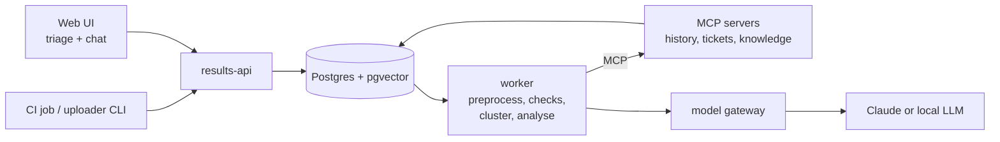

# TriageLens

AI-assisted test failure triage and test knowledge assistant for 5G device testing.
Log preprocessing, root-cause clustering, LLM analysis with evals, hybrid search with
citations, and a fully offline mode. Runs against a synthetic 5G test lab.

> **Status:** early development. The repository skeleton is in place; nothing runs yet.

## What it does

**Mode A – Triage.** Ingests a nightly test campaign (JUnit-style XML + logs), extracts the
relevant log evidence, runs deterministic checks (known failure signatures, flakiness history,
station health), groups failures that share a root cause, and lets an LLM recommend a category,
root-cause summary and matching ticket for each group. An engineer confirms or corrects every
result. Nothing is created or closed without a human.

**Mode B – Assistant.** A chat over test specifications, public 3GPP specs, runbooks and resolved
tickets. Answers cite their sources, say "not found" when the documents don't answer, and only
search what the user is allowed to see.

The LLM provider is swappable: Claude via the Anthropic API, or a local open-weight model for
on-premise and offline use.

## Architecture (target)

Code narrows the evidence first (log preprocessing, deterministic checks, clustering); the LLM then analyzes each cluster using tools over MCP. Components are added as they're built; see [docs/architecture.md](docs/architecture.md) for details.

## Data

All data in this repository is **synthetic** or comes from **public 3GPP specifications**.
The log format and test framework are invented for this project. 3GPP specs are downloaded by a
script and are not committed.

## Repository layout

| Folder | Contents |
|---|---|
| `apps/` | Services: results API, worker, MCP servers, legacy test-management mock, ingestion, uploader CLI, web UI |
| `libs/` | Shared libraries: log preprocessing, model gateway |
| `simulator/` | Synthetic test lab that generates campaigns with injected faults and ground truth |
| `data/` | Synthetic data, public spec download script, eval golden sets |
| `evals/` | Eval runner and reports |
| `deploy/` | Helm chart, ArgoCD, offline profile, Terraform |
| `scripts/` | Setup and operations scripts (Bash and PowerShell) |
| `docs/` | Architecture, decision records, devlog |

## Roadmap

- [ ] **Foundation** – simulator with ground truth, legacy test-management mock, database schema, API skeleton, uploader CLI
- [ ] **Triage core** – log preprocessing, deterministic checks, rules-only baseline, model gateway, first eval report
- [ ] **Grouping and search** – failure clustering, ticket matching, document ingestion, hybrid search with reranking
- [ ] **Assistant** – spec references in triage results, chat with citations, Claude vs local model comparison
- [ ] **MVP** – web UI, login with roles and per-project access, feedback loop
- [ ] **Security** – identifier redaction, prompt-injection defenses, leakage tests, audit log
- [ ] **Delivery** – containers, CI/CD with eval gates, offline deployment profile
- [ ] **Cloud and observability** – AWS deployment, tracing, metrics
- [ ] **Documentation** – decision records, runbook, offline installation guide, reuse guide

## License

[MIT](LICENSE)
