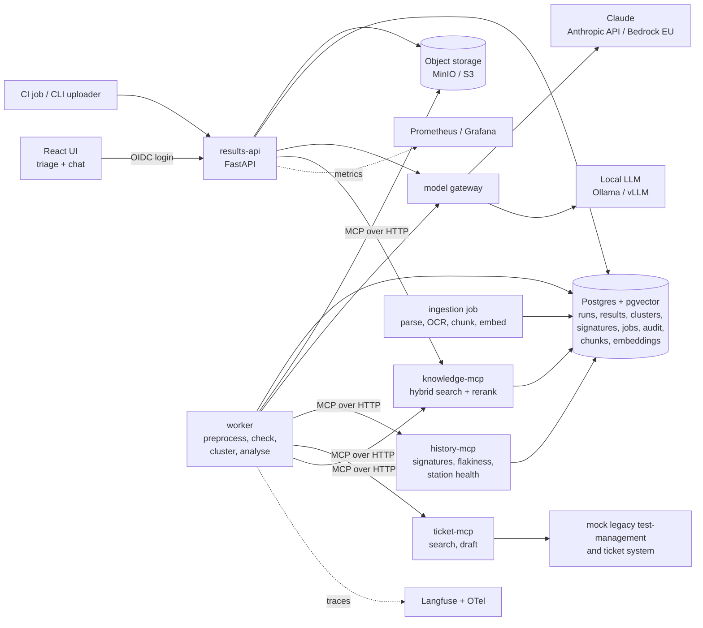

# Architecture

This is the target architecture. Components are added as they're built.

## Components

- **results-api (FastAPI):** OIDC login; campaign upload (results XML + log bundles, validated and size-limited); run, cluster and failure views; confirm/correct; ticket drafts; chat endpoint (streaming). Never runs analysis inside a request.
- **CLI / CI uploader:** small Python CLI and a GitHub Actions step that upload a campaign after a test run. Shows how TriageLens plugs into an existing pipeline.
- **worker:** Postgres job queue (`SELECT … FOR UPDATE SKIP LOCKED`); preprocess → deterministic checks → clustering → LLM analysis per cluster → ticket matching → results. Timeouts, retries with backoff, idempotent per run; failures → `Needs review`.
- **log-preprocessing library:** normalisation, key-line extraction, diff against the last passing run, token budgeting. Pure Python, heavily unit-tested, reusable on its own.
- **model gateway (library):** providers for the Anthropic API, Amazon Bedrock and OpenAI-compatible endpoints (Ollama, vLLM); provider/model per task in config; timeouts, retries, token/cost accounting, tracing.
- **history-mcp (MCP, Streamable HTTP):** `match_signatures(evidence)`, `get_test_history(test_id, n)`, `get_last_passing_run(test_id, config)`, `get_station_events(station, time_window)`. All deterministic.
- **ticket-mcp (MCP, Streamable HTTP):** `search_tickets(query, filters)`, `get_ticket(id)`, `draft_ticket(cluster_id)`. Drafts only; creation requires a human action in the UI.
- **mock legacy test-management and ticket system:** deliberately awkward (XML responses, cryptic field names, mixed German/English, paging, occasional 500s and slow responses). Adapter handles mapping, retries and caching.
- **knowledge-mcp (MCP, Streamable HTTP):** `search_documents(query, filters)`: Postgres full-text + pgvector, reciprocal rank fusion, local multilingual cross-encoder reranker; access filter in SQL **before** ranking; returns chunks with document, section and ticket IDs.
- **Ingestion job:** PDF, DOCX, PPTX and one scanned document (layout-aware parser such as Docling, OCR for scans); chunk by section; metadata (doc type, spec number/release, project, access level); local multilingual embeddings (e.g. bge-m3 or multilingual-e5). Idempotent per document version.
- **Postgres + pgvector (single database):** runs, results, clusters, signatures, feedback, jobs, audit log (append-only, hash-chained), chats, chunks with full-text index and embeddings. Read-only DB user for MCP servers.
- **Object storage:** MinIO locally/offline, S3 (encrypted, private) on AWS.
- **React UI (Vite + TypeScript):** run overview grouped by root-cause cluster; cluster detail with evidence lines, log diff, category, confidence, matched tickets, spec references; confirm/correct; ticket draft; chat view with clickable citations.
- **Auth:** Keycloak locally/offline, Cognito on AWS. Roles: `engineer`, `lead`. Per-customer-project access to tickets and device documents.
