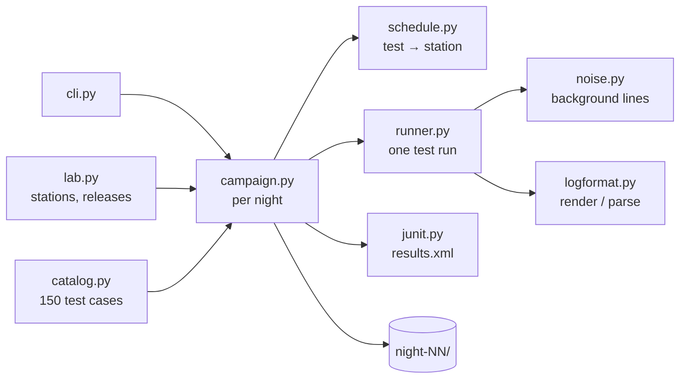

# Simulator

A synthetic 5G device test lab. It generates nightly test campaigns (JUnit-style results plus
logs) that the rest of TriageLens ingests, triages and evaluates against.

Everything it produces is **synthetic**. The log format and test framework are invented for this
project; test names follow public 3GPP procedures.

## Run it

```bash
pip install -e simulator
python -m tl_simulator generate --seed 42 --nights 20
```

Output goes to `data/synthetic/generated/` (gitignored). Add `--force` to replace an existing
campaign, or `--out <folder>` to write somewhere else.

**The same seed always produces byte-identical output**, on any OS. Labels and eval results depend
on this.

## Output

```
data/synthetic/generated/
├── lab.json                        # stations, bands, releases, test catalog
└── night-08/
    ├── metadata.json               # date, suite version, firmware per station
    ├── results.xml                 # JUnit-style; station, firmware, band, log path as properties
    └── logs/STN-03/TC_HO_INTRA_FREQ_N3.log
```

The log format is specified in [docs/log-format.md](../docs/log-format.md).

## The lab

| | |
|---|---|
| Stations | 6 (`STN-01` to `STN-06`), each supporting a subset of bands; every band is on at least 2 stations |
| Bands | n1, n3, n28, n41, n78 |
| Firmware | 2.1 from night 1, 2.2 from night 7, 2.3 from night 13; rolled out 2 stations per night |
| Test suite | 4.0 from night 1, 4.1 from night 10; all stations update at once |
| Test catalog | 5 procedure families (REG, PDU, HO, RRC, MEAS) x 6 variants x 5 bands = 150 tests |
| Nights | 20 by default; every night runs the full catalog |

## Architecture



For each night, `campaign.py`:

1. creates a random generator seeded from `(seed, night)`,
2. asks `schedule.py` to give each test to a station that supports its band,
3. runs each station's queue in order with `runner.py`, advancing that station's clock,
4. writes each log with `logformat.py`, then `results.xml` and `metadata.json`.

| Module | Responsibility |
|---|---|
| `lab.py` | Lab model and which firmware / suite version is active on a given night |
| `catalog.py` | Test cases and their protocol steps (`>>` to the device, `<<` from it) |
| `schedule.py` | Assigns each test to a station for one night |
| `runner.py` | Simulates one test: setup, protocol steps with checks, teardown; merges in noise |
| `noise.py` | Keepalives, instrument polls, harmless `W` and `E` lines |
| `logformat.py` | The invented log format: render and parse (the parser is the format's test) |
| `junit.py` | JUnit-style XML, one `<testsuite>` per procedure family |
| `campaign.py` | Orchestrates a night and writes files |
| `cli.py` | `generate` command |

## Design rules

- **One random generator per night**, seeded from `(seed, night)`. Changing one night never
  changes another: a fault added to night 3 leaves every other night byte-identical, and any night
  can be generated on its own.
- **No hidden randomness.** Nothing uses the global `random` module, the clock or `hash()`.
- **Unix line endings everywhere**, so files are byte-identical on Windows and Linux.
- **Standard library only.** No dependencies to install or pin.

## Status

All tests currently pass. Fault injection (device bugs, infrastructure, test script,
configuration, flaky), novel faults, prompt-injection lines and per-failure ground truth come in
TL-17.
